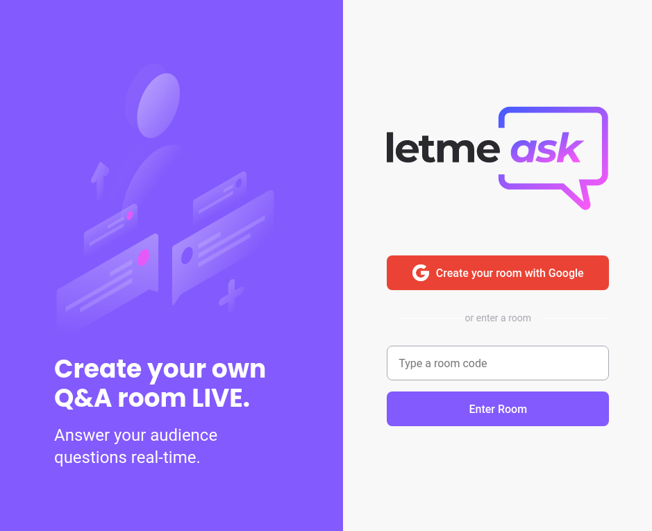
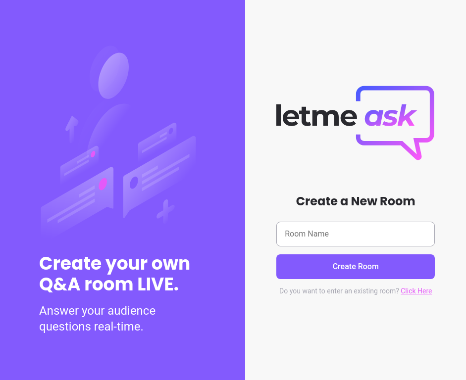
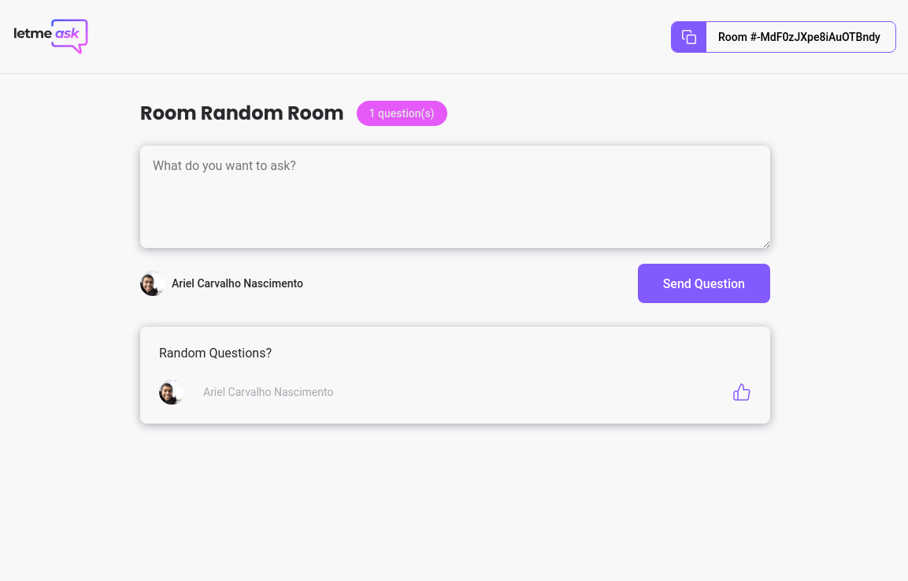
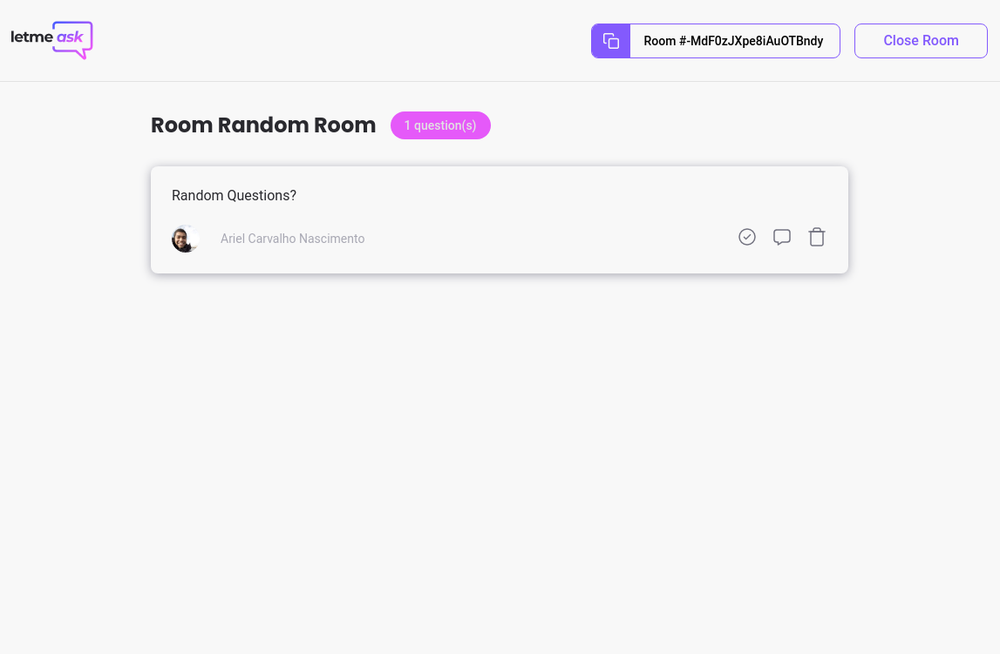

<p align="center">
  
</p>

<p align="center">
  
  
  

     
</p>

<br>

## 💻 Project

Letmeask is perfect for content creators to create Q&A rooms with their public, on an organized and democratic way.

Project developed during the **[Next Level Week Together](https://nextlevelweek.com/)**, presented during 20th to 27th june, 2021.
NLW #6.
React path taught by [Diego Fernandes](https://github.com/diego3g)

Deployed at: https://nlw6-letmeask-8d4df.web.app/

## 🧪 Technologies

Developed with the following technologies:

- [React](https://reactjs.org)
- [Firebase](https://firebase.google.com/)
- [TypeScript](https://www.typescriptlang.org/)

## 🚀 How to execute locally

Clone the project and access its folder.

```bash
$ git clone https://github.com/Arielcarv/nlw6-letmeask.git
$ cd nlw6-letmeask
```

To start it up, follow the steps bellow:

```bash
# Install dependencies
$ yarn
# Launch project
$ yarn start
```

The app will be available on your browser at http://localhost:3000.

Notice that you'll need a Firebase account [Firebase](https://firebase.google.com/) and a project there to make the Realtime Database available.

## 🔖 Layout

<h2>

| | | |
|:-------------------------:|:-------------------------:|:-------------------------:|
|  Home |   Creation| Room |
| Admin Room |  |

</h2>

You can visualize the layout of the project through the link bellow:

- [Layout Web](https://www.figma.com/file/u0BQK8rCf2KgzcukdRRCWh/Letmeask/duplicate)

You need a [Figma](http://figma.com/) account.

## 📝 License

This project is under MIT license. See file [LICENSE](LICENSE.md) for more details.

---

Made with 💜 by Rocketseat 👋🏻 [Join our community](https://discord.gg/gKUVrzrPrU)
